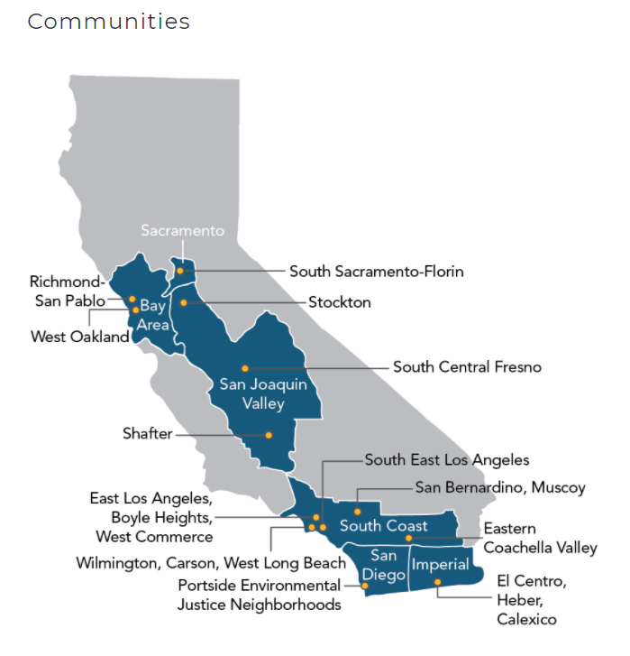
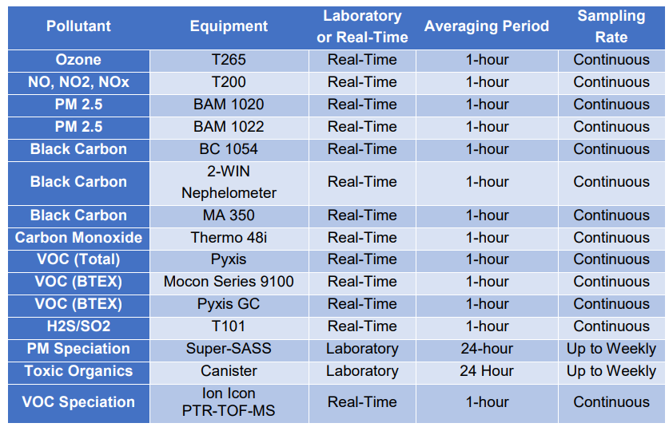
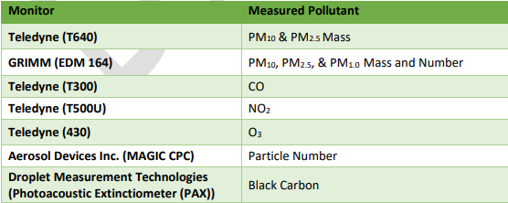
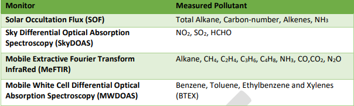
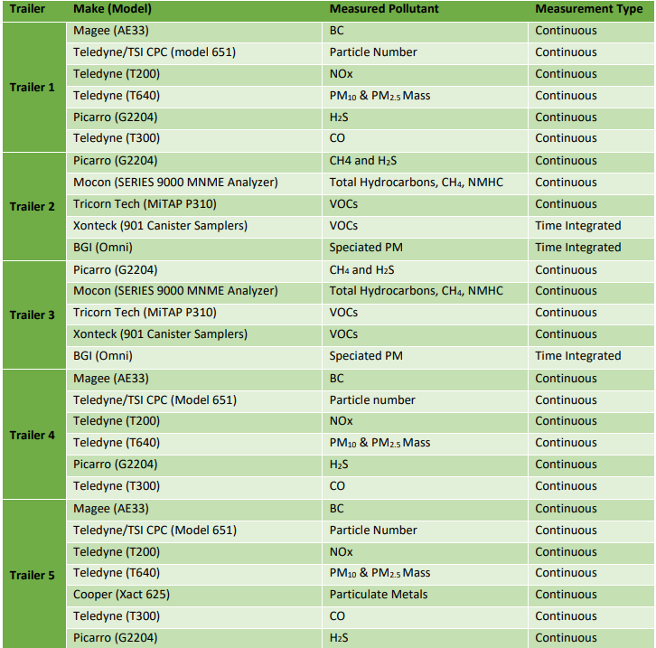

# California Assembly Bill 617

_Last updated February 24, 2021_

-----

## Table of Contents

* [Background](#background)
  * [Community monitoring](#community-monitoring)
  * [Governance](#governance)
  * [Finances](#finances)
  * [Selected Communities](#selected-communities)
* [Air Quality Data](#air-quality-data)
  * [Partner organizations](#partner-organizations)
  * [Instrumentation](#instrumentation)
  * [Data Access](#data-access)
  * [Data Graphics](#data-graphics)
* [Recent Articles](#recent-articles)

----

# Background

From: [Sacramento Metropolitan AQMD](http://www.airquality.org/air-quality-health/community-air-protection/ab-617-background)

> In 2017, Governor Brown signed [Assembly Bill 617 (C. Garcia, Chapter 136, Statutes of 2017)](https://leginfo.legislature.ca.gov/faces/billNavClient.xhtml?bill_id=201720180AB617) to develop a new community focused program to more effectively reduce exposure to air pollution and preserve public health. This bill directs the California Air Resources Board (CARB) and all local air districts, including the Sacramento Metropolitan Air Quality Management District (Sac Metro Air District or District), to take measures to protect communities disproportionally impacted by air pollution. With input from communities and air districts throughout California, [CARB developed a Community Air Protection Blueprint to implement AB 617](https://ww2.arb.ca.gov/our-work/programs/community-air-protection-program/community-air-protection-blueprint).
>
> There are five central components to the new AB 617 mandate:
> 
> * Community-level air monitoring
> * A state strategy and community specific emission reduction plans
> * Accelerated review of retrofit pollution control technologies on industrial facilities subject to Cap-and-Trade
> * Enhanced emission reporting requirements
> * Increased penalty provisions for polluters
> 
> Additionally, CARB may direct additional grant funding to communities determined to have the highest air pollution burden.

From: [Brookings Institution Report: Climate policy, environmental justice, and local air pollution](https://www.brookings.edu/wp-content/uploads/2020/10/ES-10.14.20-Fowlie-Walker-Wooley.pdf)

> AB 617 is also demonstrating proof of an essential procedural concept: Community-Driven Regulation. AB 617 is not replacing or even circumventing traditional command-and-control regulation, but rather represents a supplementary, community-based “demand-andcontrol” approach. In principle, community pressures can help build the capacity of state
agencies to eliminate racial/ethnic/class disparities in environmental exposures, bolster agency demands for greater resources, improve community influence over decisions affecting air quality, increase the likelihood that existing command-and-control regulation is implemented, and advance other mechanisms of environmental regulation .

## Community Monitoring

AB 617 requires the [CARB Governing Board](https://ww2.arb.ca.gov/about/leadership), with input from air districts and communities, to identify communities to deploy [community air monitoring](https://ww2.arb.ca.gov/capp-resource-center/community-air-monitoring). When a community is selected for air monitoring, air districts, working with the community, must deploy community air monitoring within 12 months. 

CARB has defined [14 planning elements](https://ww2.arb.ca.gov/our-work/programs/community-air-protection-program/resource-center/community-air-monitoring) that air districts, communities, and others should include in community-specific air monitoring plans developed under the Program.

The overarching goal of the “community-level air monitoring” is to develop **new community-specific emissions reduction programs** by identifying the communities with the highest air pollution burden, with a focus on criteria air pollutants and toxic air contaminants. 

From: [Brookings Institution Report](https://www.brookings.edu/wp-content/uploads/2020/10/ES-10.14.20-Fowlie-Walker-Wooley.pdf)

> AB 617 has provided critical support for community-based air quality monitoring. People need information in order to understand local problems, take action in the near term, and advocate for permanent solutions in the long term. Expanded monitoring at the neighborhood level also builds trust in the policy process and helps focus pollution control agency attention on problem areas and sources.

## Governance

From: [Brookings Institution Report](https://www.brookings.edu/wp-content/uploads/2020/10/ES-10.14.20-Fowlie-Walker-Wooley.pdf)

> AB 617 has a unique governance structure, split between CARB, communities, and local air districts. CARB provides oversight and grants to community groups to participate in the process; communities provide direction and partner with air districts on monitoring and emissions reduction programs; local air districts partner with communities on community air monitoring and emissions reduction plans, provide incentive funding, and can require stronger pollution controls for sources. 

From: [California Air Resource Board](https://ww2.arb.ca.gov/about)

> The California Air Resource Board (CARB) is the lead agency for climate change programs and oversees all air pollution control efforts in California to attain and maintain health-based air quality standards. **CARB's mission** is to promote and protect public health, welfare, and ecological resources through effective reduction of air pollutants while recognizing and considering effects on the economy.

In response to AB 617, CARB established the Community Air Protection Program (CAPP or Program). The Program’s focus is to reduce exposure in communities most impacted by air pollution. Communities around the State are working together to develop and implement new strategies to measure air pollution and reduce health impacts, counting on the support of their respective Air Quality Management Districts (AQMD) and Air Pollution Control Districts (APCD). 

## Finances

From: [CARB: Community Air Protection Blueprint](https://ww2.arb.ca.gov/sites/default/files/2020-03/final_community_air_protection_blueprint_october_2018_acc.pdf)

> To jump-start emissions reductions in disproportionately burdened communities, the fiscal year 2017-2018 State budget included $250 million to help clean up heavily polluting mobile sources, like diesel trucks and buses. Further, the fiscal year 2018-2019 State budget includes an additional $245 million in funding for continuing AB 617 emissions reduction effort.

From: [CARB: Community Air Protection Incentives]( https://ww2.arb.ca.gov/our-work/programs/community-air-protection-incentives/about)

>	Since 2017 the California Legislature has budgeted $704 million to support Assembly Bill (AB) 617 (C. Garcia, Chapter 136, Statutes of 2017) with incentives directed by local air districts to put advanced technologies to work for cleaner air in the California communities that are most heavily impacted by disproportionate levels of air pollution.

From: [Biannual Report on AB 617 Community Air Protection Incentives](https://ww2.arb.ca.gov/sites/default/files/2020-06/cap_incentives_april_2020_board_update.pdf)

> The Legislature has appropriated money from the Greenhouse Gas
Reduction Fund (GGRF) for incentives to support AB 617, as summarized in Table 1 in
the Appendix. 

According to this report, the "liquidation deadline" for the 2020-2021 budget of $200 million proposed by the Governor is yet to be defined. 

## Selected Communities

From: [CARB: CAPP communities](https://ww2.arb.ca.gov/capp-communities)

The following communities are currently involved in CAPP:

<table>

<thead>
  <tr>
    <th>Community</th>
    <th>Air District</th>
    <th>Emissions Reduction</th>
    <th>Air Monitoring</th>
  </tr>
</thead>

<tbody>
  <tr>
    <td>
<a href="//ww2.arb.ca.gov/our-work/programs/community-air-protection-program/communities/richmond-san-pablo">Richmond - San Pablo</a>
    </td>
    <td>
<a href="https://www.baAQMD.gov/community-health/community-health-protection-program">Bay Area AQMD</a>
    </td>
    <td>
    &nbsp;
    </td>
    <td>
<a href="https://www.baAQMD.gov/community-health/community-health-protection-program/richmond-area-community-health-protection-program">2018</a>
    </td>
  </tr>
  <tr>
    <td>
<a href="//ww2.arb.ca.gov/our-work/programs/community-air-protection-program/communities/west-oakland">West Oakland</a>
    </td>
    <td>
<a href="https://www.baAQMD.gov/community-health/community-health-protection-program">Bay Area AQMD</a>
    </td>
    <td>
<a href="https://www.baAQMD.gov/community-health/community-health-protection-program/west-oakland-community-action-plan">2018</a>
    </td>
    <td>
    &nbsp;
    </td>
  </tr>
  <tr>
    <td>
<a href="//ww2.arb.ca.gov/our-work/programs/community-air-protection-program/communities/calexico-el-centro-heber">El Centro, Heber,&nbsp;Calexico</a>
    </td>
    <td>
<a href="https://www.icab617community.org/">Imperial County APCD</a>
    </td>
    <td>
<a href="https://c1b3e492-1448-4e62-b7f8-7aaf61550a90.filesusr.com/ugd/99eb03_080a305618f5453cb0c69272eb622946.pdf" aria-describedby="audioeye_pdf_message">2018</a>
    </td>
    <td>
<a href="https://c1b3e492-1448-4e62-b7f8-7aaf61550a90.filesusr.com/ugd/99eb03_4aacc3a0f9b34bbbbc9c908b8ba628bc.pdf" aria-describedby="audioeye_pdf_message">2018</a>
    </td>
  </tr>
  <tr>
    <td>
<a href="//ww2.arb.ca.gov/our-work/programs/community-air-protection-program/communities/south-sacramento-florin">South Sacramento - Florin</a>
    </td>
    <td>
<a href="http://www.airquality.org/Air-Quality-Health/Community-Air-Protection">Sacramento Metropolitan AQMD</a>
    </td>
    <td>
    &nbsp;
    </td>
    <td>
<a href="http://www.airquality.org/Air-Quality-Health/Community-Air-Protection/Community-Air-Monitoring">2018</a>
    </td>
  </tr>
  <tr>
    <td>
<a href="//ww2.arb.ca.gov/our-work/programs/community-air-protection-program/communities/portside-environmental-justice">Portside Environmental Justice Neighborhoods</a>
    </td>
    <td>
<a href="https://www.sandiegocounty.gov/content/sdc/apcd/en/community-air-protection-program--ab-617-.html">San Diego County APCD</a>
    </td>
    <td>
    2019
    </td>
    <td>
<a href="https://www.sandiegocounty.gov/content/dam/sdc/apcd/PDF/AB_617/AB-617%20Elements%20and%20Required%20Criteria_San%20Diego_June%202019.pdf" aria-describedby="audioeye_pdf_message">2018</a>
    </td>
  </tr>
  <tr>
    <td>
<a href="//ww2.arb.ca.gov/our-work/programs/community-air-protection-program/communities/shafter">Shafter</a>
    </td>
    <td>
<a href="http://community.valleyair.org/">San Joaquin Valley APCD</a>
    </td>
    <td>
<a href="http://community.valleyair.org/media/1515/01-finalshaftercerp-9-19-19.pdf" aria-describedby="audioeye_pdf_message">2018</a>
    </td>
    <td>
<a href="http://community.valleyair.org/selected-communities/shafter/air-monitoring/">2018</a>
    </td>
  </tr>
  <tr>
    <td>
<a href="//ww2.arb.ca.gov/our-work/programs/community-air-protection-program/communities/south-central-fresno">South Central Fresno</a>
    </td>
    <td>
<a href="http://community.valleyair.org/">San Joaquin Valley APCD</a>
    </td>
    <td>
<a href="http://community.valleyair.org/media/1516/01finalscfresnocerp-9-19-19.pdf" aria-describedby="audioeye_pdf_message">2018</a>
    </td>
    <td>
<a href="http://community.valleyair.org/selected-communities/south-central-fresno/air-monitoring/">2018</a>
    </td>
  </tr>
  <tr>
    <td>
<a href="//ww2.arb.ca.gov/our-work/programs/community-air-protection-program/communities/southwest-stockton">Southwest Stockton</a>
    </td>
    <td>
<a href="http://community.valleyair.org/">San Joaquin Valley APCD</a>
    </td>
    <td>
    2019
    </td>
    <td>
    2019
    </td>
  </tr>
  <tr>
    <td>
<a href="//ww2.arb.ca.gov/our-work/programs/community-air-protection-program/communities/east-los-angeles-boyle-heights-west">East Los Angeles, Boyle Heights, West Commerce</a>
    </td>
    <td>
<a href="http://www.AQMD.gov/nav/about/initiatives/community-efforts/environmental-justice/ab617-134?page=2">South Coast AQMD</a>
    </td>
    <td>
<a href="http://www.AQMD.gov/nav/about/initiatives/community-efforts/environmental-justice/ab617-134/east-la/cerp-documents">2018</a>
    </td>
    <td>
<a href="http://www.AQMD.gov/docs/default-source/ab-617-ab-134/camps/elabhwc-camp.pdf?sfvrsn=4">2018</a>
    </td>
  </tr>
  <tr>
    <td>
<a href="//ww2.arb.ca.gov/our-work/programs/community-air-protection-program/communities/eastern-coachella-valley">Eastern Coachella Valley</a>
    </td>
    <td>
<a href="http://www.AQMD.gov/nav/about/initiatives/community-efforts/environmental-justice/ab617-134?page=2">South Coast AQMD</a>
    </td>
    <td>
    2019
    </td>
    <td>
    2019
    </td>
  </tr>
  <tr>
    <td>
<a href="//ww2.arb.ca.gov/our-work/programs/community-air-protection-program/communities/san-bernardino-muscoy">San Bernardino, Muscoy</a>
    </td>
    <td>
<a href="http://www.AQMD.gov/nav/about/initiatives/community-efforts/environmental-justice/ab617-134?page=2">South Coast AQMD</a>
    </td>
    <td>
<a href="http://www.AQMD.gov/nav/about/initiatives/community-efforts/environmental-justice/ab617-134/san-b/cerp-docs">2018</a>
    </td>
    <td>
<a href="http://www.AQMD.gov/docs/default-source/ab-617-ab-134/camps/sbm_camp.pdf?sfvrsn=6">2018</a>
    </td>
  </tr>
  <tr>
    <td>
<a href="//ww2.arb.ca.gov/our-work/programs/community-air-protection-program/communities/south-east-los-angeles">South East Los Angeles</a>
    </td>
    <td>
<a href="http://www.AQMD.gov/nav/about/initiatives/community-efforts/environmental-justice/ab617-134?page=2">South Coast AQMD</a>
    </td>
    <td>
    2019
    </td>
    <td>
    2019
    </td>
  </tr>
  <tr>
    <td>
<a href="//ww2.arb.ca.gov/our-work/programs/community-air-protection-program/communities/wilmington-carson-west-long-beach">Wilmington, Carson, West Long Beach</a>
    </td>
    <td>
    <a href="http://www.AQMD.gov/nav/about/initiatives/community-efforts/environmental-justice/ab617-134?page=2">South Coast AQMD</a>
    </td>
    <td>
    <a href="http://www.AQMD.gov/nav/about/initiatives/community-efforts/environmental-justice/ab617-134/wilm/cerp-docs">2018</a>
    </td>
    <td>
    <a href="http://www.AQMD.gov/docs/default-source/ab-617-ab-134/camps/wcwlb_camp.pdf?sfvrsn=6">2018</a>
    </td>
  </tr>

</tbody>
</table>

### Community selection

Since 2018, more than 120 communities have been nominated for consideration for community actions defined as monitoring and/or emission reduction programs, but only 13 have been approved. 
The [CARB website](https://ww2.arb.ca.gov/capp-selection) does not include a clear plan for 2021. They mention that "one of the main lessons learned is that building new community partnerships and developing and implementing effective community-focused programs takes time and resources" and that the 2020-2021 state budget is very limited, affecting the number of communities that can benefit from AB 617. 

# Air Quality Data

## Partner Organizations

The Community Air Protection Program includes a [multi-stakeholder Consultation Group]( https://ww2.arb.ca.gov/our-work/programs/community-air-protection-program-ab617/community-air-protection-program-consultation-group), whose members work for environmental justice organizations, air districts, industry, academia, public health organizations, and local government. Below is a list of the organizations currently involved:

* [Central California Environmental Justice Network](https://ccejn.org/)
* [Physicians for Social Responsibility - Los Angeles (PSR-LA)](https://www.psr-la.org/)
*	[University of California](https://www.universityofcalifornia.edu/)
*	[American Lung Association](https://www.lung.org/)
*	[Bay Area Air Quality Management District](https://www.baaqmd.gov/)
*	[California Department of Public Health/California Environmental Health Tracking Program](https://www.phi.org/our-work/programs/tracking-california/)
*	[Environmental Health Coalition](https://www.environmentalhealth.org/index.php/en/)
*	[Blue Lake Rancheria Tribe](https://bluelakerancheria-nsn.gov/)
*	[West Oakland Environmental Indicators Project](https://woeip.org/)
* [Central California Asthma Collaborative](http://cencalasthma.org/)
*	[California Cotton Ginners and Growers Association](https://ccgga.org/)
*	[California Air Pollution Control Officers Association (CAPCOA)](http://www.capcoa.org/)
*	[Institute for Local Government](https://www.ca-ilg.org/)
*	[Los Angeles Community Environmental Enforcement Network/Coalition for a Safe Environment](http://www.coalitionfase.org/)
*	[Local Government Commission](https://www.lgc.org/)
*	[South Coast Air Quality Management District](http://www.aqmd.gov/)
*	[Comité Cívico del Valle](https://www.ccvhealth.org/)
*	[San Diego State University](https://www.sdsu.edu/)
*	[Western States Petroleum Association](https://www.wspa.org/)
*	[San Joaquin Valley Air Pollution Control District](https://www.valleyair.org/Home.htm)
*	[California Council for Environmental and Economic Balance (CCEEB)](https://cceeb.org/)
*	[BlueGreen Alliance](https://www.bluegreenalliance.org/)

## Instrumentation

A general summary on the monitoring technologies employed by communities and the science behind them can be found
in the CAPP resource center [Outline of Measurement Technologies](https://ww2.arb.ca.gov/capp-resource-center/community-air-monitoring/outline-of-measurement-technologies). 

Below, we provide a closer look at the monitoring methods/equipment employed by each of the 13 communities as described in their Community Air Monitoring Plans and other linked resources:

* [Richmond-San Pablo Community]( https://www.baaqmd.gov/community-health/community-health-protection-program/richmond-area-community-health-protection-program): custom-designed Aclima mobile sensor nodes, measuring carbon dioxide (CO2), carbon monoxide (CO), nitric oxide (NO), nitrogen dioxide (NO2), ozone (O3), and particulate matter (PM2.5) (From: [Community Air Monitoring Plan](https://www.baaqmd.gov/~/media/files/ab617-community-health/richmond/richmondsanpabloairmonitoringplanjuly2020-pdf.pdf?la=en))

* [West Oakland Community](https://ww2.arb.ca.gov/our-work/programs/community-air-protection-program/communities/west-oakland): no methods/technologies/sensors found. The community could obtain their data from the [Bay Area Air Quality Management District](https://www.baaqmd.gov/) which employs low-cost sensors such as PurpleAir, Clarity, and PM sensors to count particles. This info can be found in the [Air Quality Data Sources Explained]( https://www.baaqmd.gov/~/media/files/communications-and-outreach/wildfire-materials/air-quality-data-sources-explained-pdf.pdf?la=en) document. Moreover, the [West Oakland Environmental Indicators Project]( https://woeip.org/) partnered with the Air District and a community-based Steering Committee to develop [Owning Our Air: The West Oakland Community Action Plan](https://www.baaqmd.gov/~/media/files/ab617-community-health/west-oakland/2020_1101_wo_annual_report_slide_deck-pdf.pdf?la=en) which includes 6 Air District measures and 8 CARB measures.

* [El Centro, Heber, Calexico Community](https://ww2.arb.ca.gov/our-work/programs/community-air-protection-program/communities/calexico-el-centro-heber): Dylos DC1700 sensor (light-scattering particle counter) (From: [Community Air Monitoring Plan](https://c1b3e492-1448-4e62-b7f8-7aaf61550a90.filesusr.com/ugd/99eb03_4aacc3a0f9b34bbbbc9c908b8ba628bc.pdf))

* [South Sacramento-Florin Community](https://ww2.arb.ca.gov/our-work/programs/community-air-protection-program/communities/south-sacramento-florin): the District will deploy 21 Clarity Node sensors, which calculate PM2.5 mass concentrations at near-real time (approximately 15 minute) resolution using a laser particle counter. The Clarity Node sensors also include NO2 sensors, but preliminary testing indicates NO2 sensors in the Clarity may not be accurate enough for all data uses. The District will evaluate the NO2 data from the low-cost sensors and determine suitable uses for those data. Other low-cost and professional grade sensors include PM2.5, Ozone, and Mini-aethalometer. An exhaustive list of all monitors/sensors employed at each phase of the monitoring plan can be found in the [Final Community Air Monitoring Plan June 2020](http://www.airquality.org/AB617/Documents/Final%20Community%20Air%20Monitoring%20Plan%20July%202020%20(1).pdf).

* [Portside Environmental Justice Neighborhoods Community]( https://ww2.arb.ca.gov/our-work/programs/community-air-protection-program/communities/portside-environmental-justice): the [Community Air Monitoring Plan]( https://www.sandiegocounty.gov/content/dam/sdc/apcd/PDF/AB_617/AB-617%20Elements%20and%20Required%20Criteria_San%20Diego_June%202019.pdf) only mentions the use of low-cost sensors and that more info regarding the data collected will be available in the AB 617 Community Air Quality Viewer ([AQview](https://aqview.arb.ca.gov/)).

* [Shafter Community]( https://ww2.arb.ca.gov/our-work/programs/community-air-protection-program/communities/shafter): adoption of an air monitoring network design including the use of several fixed, mobile, and semi-mobile monitoring platforms, all of which are equipped to detect the community-specific pollutants of concern as shown in the table below. (From: [Community Air Monitoring Plan]( http://community.valleyair.org/media/1306/shafter_camp_-v1_-2019_july.pdf))

* [South Central Fresno Community]( https://ww2.arb.ca.gov/our-work/programs/community-air-protection-program/communities/south-central-fresno): same as Shafter community, but does not include VOC Speciation pollutant. (From: [Community Air Monitoring Plan]( http://community.valleyair.org/media/1308/fresno_camp_v1_2019_july-1.pdf))

* [Southwest Stockton Community]( https://ww2.arb.ca.gov/our-work/programs/community-air-protection-program/communities/southwest-stockton): no sensors/monitors available. The community is in the process of drafting a Community Emissions Reduction Program, and the plan is expected to be published and available in 2021. 

* [East Los Angeles, Boyle Heights, West Commerce Community](https://ww2.arb.ca.gov/our-work/programs/community-air-protection-program/communities/east-los-angeles-boyle-heights-west): lists of mobile monitors/sensors (first two tables) and fixed monitors/sensors (third table) are included below. (From: [Community Air Monitoring Plan](http://www.aqmd.gov/docs/default-source/ab-617-ab-134/camps/elabhwc-camp.pdf?sfvrsn=4))

* [Eastern Coachella Valley Community](https://ww2.arb.ca.gov/our-work/programs/community-air-protection-program/communities/eastern-coachella-valley): in the process of drafting a Community Emissions Reduction Program expected to be published in 2021. Currently available is the [November 2020 Discussion Draft](http://www.aqmd.gov/nav/about/initiatives/community-efforts/environmental-justice/ab617-134/eastern-coachella-valley/cerp-archive) which does not include specific details about sensors/monitors. 

* [San Bernardino and Muscoy Community](https://ww2.arb.ca.gov/our-work/programs/community-air-protection-program/communities/san-bernardino-muscoy): same as East Los Angeles, Boyle Heights, West Commerce Community. (From: [Community Air Monitoring Plan](http://www.aqmd.gov/docs/default-source/ab-617-ab-134/camps/sbm_camp.pdf?sfvrsn=6).\)

* [Southeast Los Angeles Community](https://ww2.arb.ca.gov/our-work/programs/community-air-protection-program/communities/south-east-los-angeles): in the process of drafting a Community Emissions Reduction Program expected to be published in 2021. Currently available is the [October 2020 Discussion Draft](http://www.aqmd.gov/nav/about/initiatives/community-efforts/environmental-justice/ab617-134/southeast-los-angeles/cerp-archive), which does not include specific details about sensors/monitors. 

* [Wilmington, West Long Beach, and Carson Community](https://ww2.arb.ca.gov/our-work/programs/community-air-protection-program/communities/wilmington-carson-west-long-beach): same as East Los Angeles, Boyle Heights, West Commerce Community. (From: [Community Air Monitoring Plan]( http://www.aqmd.gov/docs/default-source/ab-617-ab-134/camps/wcwlb_camp.pdf?sfvrsn=6))

Most communities use **low-cost sensors** and, due to their novelty, there is no well-established, widely accepted set of data quality indicators. The South Coast Air Quality Management District ([SCAQMD](http://www.aqmd.gov/)) evaluates and shares sensor evaluation through their Air Quality Sensor Performance Evaluation Center ([AQ-SPEC]( http://www.aqmd.gov/aq-spec)). This program evaluates the performance of sensors both in laboratory and field applications to help inform the general public of the performance of commercially available sensors. Similarly, the US [EPA's air sensor toolbox](https://www.epa.gov/air-sensor-toolbox) provides guidelines on best practices in the selection, use, and data interpretation of air sensors. (From: [Air Sensor Toolbox]( https://www.epa.gov/air-sensor-toolbox/how-use-air-sensors-air-sensor-guidebook))

## Data Access

At a higher level (air basins, or counties) air quality data is accessible through the [Air Quality Data (PST) Query Tool](https://www.arb.ca.gov/aqmis2/aqdselect.php), which generates csv reports on [criteria pollutants](https://www.epa.gov/criteria-air-pollutants), including toxics, greenhouse gas emissions and PM2.5.

At the community level, data is temporally and geographically limited. Only 7 out of the 13 communities currently under monitoring provide reports, and the most recent reports are from May 2020 or earlier depending on the community. 

The following list of the communities provide some downloadable data through a
[CARB data access site](https://aqview.arb.ca.gov/data.html):

* East Los Angeles, Boyle Heights, West Commerce
* San Bernardino, Muscoy
* Portside Environmental Justice Neighborhoods
* Shafter
* South Central Fresno
* South Sacramento - Florin
* Wilmington, Carson, West Long Beach

Parameters available in the reports include: `Community Name`, `Data Provider`, 
`Site Name`, `Latitude`, `Longitude`, `Elevation`, `Monitor ID`, `Parameter Code`, 
`Parameter Name`, `Measurement Start Time`, `Measured Value`, `Adjusted Value`, 
`Units`, `Adjustment Description`, and `Instrument`. Some communities also include 
`Measurement Technique Description` and `Measurement Technique Code`. The column 
names in the reports vary slightly depending on the community. For instance, 
South Sacramento – Florin has the column `Measurement Start Time` while San 
Bernardino, Muscoy has the column `StartDateTime`. Description of each column 
content and details on the downloadable data can be found in the 
[Data Download Explainer](https://aqview.arb.ca.gov/Resources/Data-Download-Explainer.pdf). 

Criteria and toxic pollutant emissions data are stored in the California Emissions Inventory Development and Reporting System ([CEIDARS]( https://ww3.arb.ca.gov/ei/drei/maintain/dbstruct.htm)), which serves as the main repository for emissions data used to develop air quality management plans to show attainment and maintenance of ambient air quality standards. GHG emissions data are stored in CARB’s Mandatory Reporting Regulation ([MRR]( https://ww2.arb.ca.gov/our-work/programs/mandatory-greenhouse-gas-emissions-reporting)) database. MMR's Facility IDs are different from CEIDARS's database IDs.

CARB has released a [Pollution Mapping Tool]( https://ww3.arb.ca.gov/ei/tools/pollution_map/pollution_map.htm) which allows users to explore maps and also to visualize graphs and export data on emissions from large facilities (stationary point sources). However, the most recent year available is 2018. Also, there are [caveats about using data in the tool for Comparative analyses](https://ww3.arb.ca.gov/ei/tools/pollution_map/doc/caveats%20document10_19_2020.pdf) since the criteria, toxic and GHG pollutant emissions data presented in the tool are collected through different emissions reporting programs, each designed to meet specific goals. In a quick exploration in January, 2021, the tool seems slow and not very user friendly.

CARB will also be launching a new air quality viewer called [AQview](https://aqview.arb.ca.gov/), which will focus on displaying air quality data collected in AB 617 communities. While community data are the focus for AQview, CARB will provide air quality data from many existing sources to create a single, central hub for viewing the current air quality across the state. AQview is currently under construction and is scheduled to launch in phases. Bookmark the [Community Air Quality Portal](https://ww2.arb.ca.gov/community-air-quality-portal) webpage to keep up-to-date with releases.

## Data Graphics

The community of [Shafter](http://community.valleyair.org/selected-communities/shafter/community-air-monitoring/) and [South Central Fresno](http://community.valleyair.org/selected-communities/south-central-fresno/community-air-monitoring/) (Air district [San Joaquin Valley APCD](http://community.valleyair.org/)) have a dedicated webpage showing active monitors and weekly air monitoring updates on PM2.5 and PM10 (μg/m3) levels ([graphic example](http://community.valleyair.org/media/2311/1312021-shafter-weekly-update.pdf)).   

The community of [Sacramento-Florin](http://www.airquality.org/Air-Quality-Health/Community-Air-Protection/Community-Air-Monitoring) (Air district [Sacramento Metropolitan](http://www.airquality.org/)) has a dedicated webpage comprising a dynamic AB617 Community Air Monitoring Map showing PM2.5 AQI for each monitor, and information about the monitors and sensors employed such as sensor name, type of monitor, facility name, address, and installation date.
The remaining AB 617 communities do not yet offer user-friendly tools to stay up-to-date with air quality conditions. 

----

## Recent Articles

Fontana Herald News, Jan 28, 2021: **[Investment in clean air programs needed](https://www.fontanaheraldnews.com/opinion/investment-in-clean-air-programs-needed/article_a3534c00-6196-11eb-9269-2f33f0fe3404.html)**

> We applaud the governor’s *$325 million allotments to the Community Air Protection Program (AB 617)*, aiming to reduce emissions in communities with disproportionate exposure to air pollution. This support includes grants to community-based organizations, implementation funding for local air districts, and cleaner vehicles and equipment incentives. These allotted dollars must not be prioritized on a first-come, first-serve basis but across frontline communities based on the need and necessity for this infrastructure. Lastly, this funding is a step in the right direction but does not address the inequity in distributing funds from AB 617 funding and budgets.

48 Hills, Jan 17, 2021**[Newsom budget hurts environmental justice programs](https://48hills.org/2021/01/newsom-budget-hurts-environmental-justice-programs/)**

> Newsom’s proposed state budget lets utilities, such as PG&E, off the hook for funding wildfire prevention and recovery from wildfires, and puts the burden on the state. That means that *equity-designed programs don’t get the funding they need to continue functioning — ultimately disproportionately affecting low-income communities and communities of color.*

The Nation, Dec 24, 2020: **[This California Law Offers Biden a Tool in the Fight for Environmental Justice](https://www.thenation.com/article/environment/ab617-environment-california-epa/)**

> With a community-based approach, AB 617 could help guide Biden’s EPA in leveraging the 1970 Clean Air Act to fight for racial justice […] “One of the geniuses of the American democracy is that laypeople at the community level can have a real and meaningful impact,” says David Wooley, a public policy professor at the University of California–Berkeley, who co-authored a new [Brookings Institution study](https://www.brookings.edu/research/climate-policy-environmental-justice-and-local-air-pollution/) arguing that California’s experience with AB 617 could help guide the EPA in leveraging the 1970 Clean Air Act to fight for racial justice. “If you don’t have that community involvement, then that’s a failure of democracy.”

