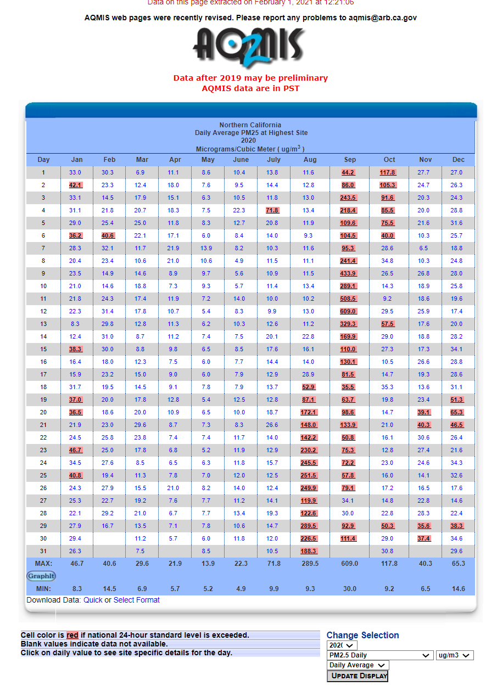

# California Assembly Bill 617

_Last updated January 31, 2021_

----

## Background

(http://www.airquality.org/air-quality-health/community-air-protection/ab-617-background)

> In 2017, Governor Brown signed [Assembly Bill 617 (C. Garcia, Chapter 136, Statutes of 2017)](https://leginfo.legislature.ca.gov/faces/billNavClient.xhtml?bill_id=201720180AB617) to develop a new community focused program to more effectively reduce exposure to air pollution and preserve public health. This bill directs the California Air Resources Board (CARB) and all local air districts, including the Sacramento Metropolitan Air Quality Management District (Sac Metro Air District or District), to take measures to protect communities disproportionally impacted by air pollution. With input from communities and air districts throughout California, [CARB developed a Community Air Protection Blueprint to implement AB 617](https://ww2.arb.ca.gov/our-work/programs/community-air-protection-program/community-air-protection-blueprint).
>
> There are five central components to the new AB 617 mandate:
> 
> * Community-level air monitoring
> * A state strategy and community specific emission reduction plans
> * Accelerated review of retrofit pollution control technologies on industrial facilities subject to Cap-and-Trade
> * Enhanced emission reporting requirements
> * Increased penalty provisions for polluters
> 
> Additionally, CARB may direct additional grant funding to communities determined to have the highest air pollution burden.

----

# _TODO:_

# Overall

## How much money is being spent (annualy?) and where does it come from?

_TODO_

# Community monitoring component

_TODO_

## Summarise the goals of the "community-level air monitoring" component.

_INPROGRESS_

The overarching goal of the “community-level air monitoring” is to identify the communities with the highest air pollution burden, with a focus on criteria air pollutants and toxic air contaminants, to develop *new community-specific emissions reduction programs*. 

## How much money is being spent (annualy?) and where does it come from?

_INPROGRESS_
> To jump-start emissions reductions in disproportionately burdened communities, the fiscal year 2017-2018 State budget included $250 million to help clean up heavily polluting mobile sources, like diesel trucks and buses. Further, the fiscal year 2018-2019 State budget includes an additional $245 million in funding for continuing AB 617 emissions reduction effort ([Community Air Protection Blueprint](https://ww2.arb.ca.gov/sites/default/files/2020-03/final_community_air_protection_blueprint_october_2018_acc.pdf)).

>	Since 2017 the California Legislature has [budgeted $704 million]( https://ww2.arb.ca.gov/our-work/programs/community-air-protection-incentives/about) to support Assembly Bill (AB) 617 (C. Garcia, Chapter 136, Statutes of 2017) with incentives directed by local air districts to put advanced technologies to work for cleaner air in the California communities that are most heavily impacted by disproportionate levels of air pollution.

> The Legislature has appropriated money from the Greenhouse Gas
Reduction Fund (GGRF) for incentives to support AB 617, as summarized in Table 1 in
the Appendix of the [Biannual Report on AB 617 Community Air Protection Incentives](https://ww2.arb.ca.gov/sites/default/files/2020-06/cap_incentives_april_2020_board_update.pdf). 

According to this report, the deadline of the 2020-2021 budget of $200 million proposed by the Governor is yet to be defined. 

## Which state agencies are in charge?

_TODO_

## Which communities are involved?

_INPROGRESS_
The [communities involved]( https://ww2.arb.ca.gov/capp-communities) are the following:
* Calexico, El Centro, Heber
* East Los Angeles, Boyle Heights, West Commerce
* Eastern Coachella Valley
* Portside Environmental Justice Neighborhoods
* Richmond - San Pablo
* San Bernardino, Muscoy
* Shafter
* South Central Fresno
* South East Los Angeles
* South Sacramento - Florin
* Southwest Stockton
* West Oakland
* Wilmington, Carson, West Long Beach

## What progress has been made to date?

_INPROGRESS_
Since 2018, more than 120 communities have been nominated for consideration for community actions defined as monitoring and/or emission reduction programs, but only 13 have been approved. 
The [CARB website](https://ww2.arb.ca.gov/capp-selection) does not include a clear plan for 2021, but it mentions that "one of the main lessons learned is that building new community partnerships and developing and implementing effective community-focused programs takes time and resources" and that the 2020-2021 state budget is very limited, thus affecting the number of communities that were considered for addition to the Program in 2020 and those that could be added in 2021. 

## Which of the Air Quality Managment Districts (AQMDs) have made the most progress?

_TODO_

## What other organizations (federal agencies universities, NGOs, ...) have been working with community data.

_INPROGRESS_
The Community Air Protection Program includes a [multi-stakeholder Consultation Group]( https://ww2.arb.ca.gov/our-work/programs/community-air-protection-program-ab617/community-air-protection-program-consultation-group), whose members work for environmental justice organizations, air districts, industry, academia, public health organizations, and local government. Below is a comprehensive list of the organizations involved:

* Central California Environmental Justice Network
* Physicians for Social Responsibility - Los Angeles (PSR-LA)
*	University of California
*	American Lung Association
*	Bay Area Air Quality Management District
*	California Department of Public Health/California Environmental Health Tracking Program
*	Environmental Health Coalition
*	Blue Lake Rancheria Tribe
*	West Oakland Environmental Indicators Project
* Central California Asthma Collaborative
*	California Cotton Ginners and Growers Association
*	California Air Pollution Control Officers Association (CAPCOA)
*	Institute for Local Government
*	Los Angeles Community Environmental Enforcement Network/Coalition for a Safe Environment
*	Local Government Commission
*	South Coast Air Quality Management District
*	Comité Cívico del Valle
*	San Diego State University
*	Western States Petroleum Association
*	San Joaquin Valley Air Pollution Control District
*	California Council for Environmental and Economic Balance (CCEEB)
*	BlueGreen Alliance

## To what extent is community monitoring data open access?

_INPROGRESS_
The community monitoring data is open access. It is possible to have reports on [criteria](https://www.epa.gov/criteria-air-pollutants), toxic, and GHG pollutant emissions, including PM2.5. 
To access the [Air Quality Data (PST) Query Tool](https://www.arb.ca.gov/aqmis2/aqdselect.php) Click “air quality” on left shoulder of web page. You can get weekly and yearly data of any county and in csv format as well. Following, the 2020 PM2.5 emissions in Northern California. 

CARB has also released a [Pollution Mapping Tool]( https://ww3.arb.ca.gov/ei/tools/pollution_map/pollution_map.htm), which allows users to explore maps but also to visualize graphs and export data about emissions from large facilities (stationary point sources). However, the most recent year available is 2018, and there are [caveats about using data in the tool for Comparative analyses](https://ww3.arb.ca.gov/ei/tools/pollution_map/doc/caveats%20document10_19_2020.pdf) since the criteria, toxic and GHG pollutant emissions data presented in the tool are collected through different emissions reporting programs, each designed to meet specific goals. 

## What types of sensors/monitors are being used to generate data?

_TODO_

## What types of analysis have been done on this data?

_TODO_

## What software tools are being used to analyze this data?

_TODO_

## _Other interesting questions that come up_

_TODO_
